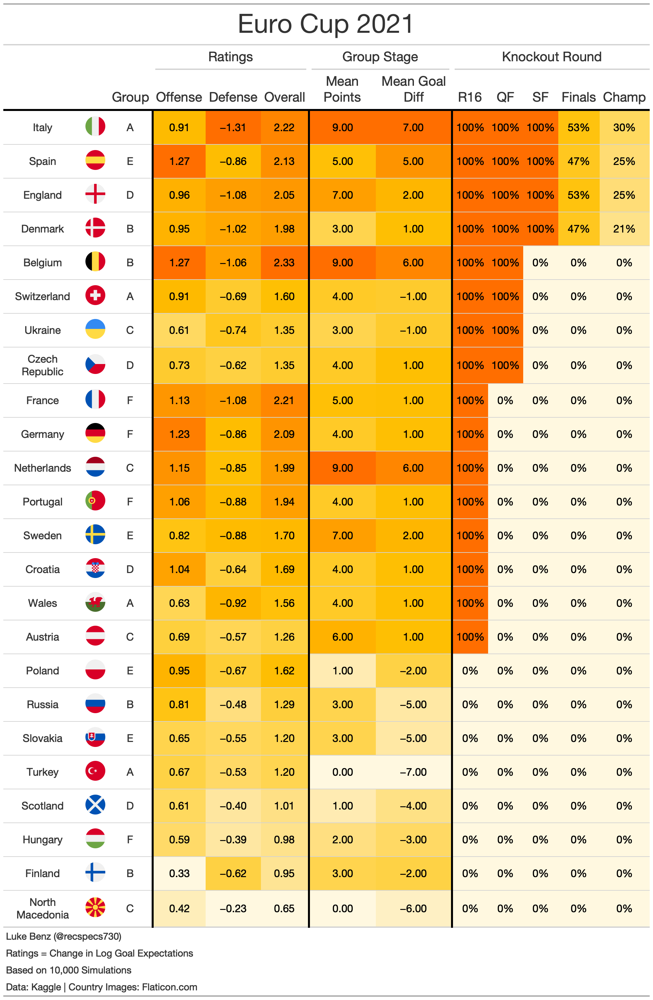

# Euro Cup 2021
---
Modeling and simulation of the 2021 Euro Cup.

#### Model Script

* __fit_model.R:__ Estimates Bayesian bivariate Poisson model. For more details, see Equation (2) of [Benz and Lopez, 2021](https://arxiv.org/abs/2012.14949).

#### Simulations

* __run_sim.R:__ Run 10,000 simulations of the tournament
* __helpers.R:__ Helper functions for sims.

#### Data
Data (__internation_soccer_score.csv__) courtesy [Kaggle](https://www.kaggle.com/martj42/international-football-results-from-1872-to-2017).

Flag figures courtesy of [Flaticon](https://www.flaticon.com/).

#### Pre-Tournament Predictions
